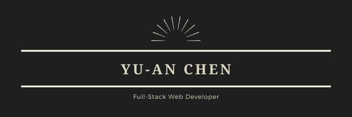
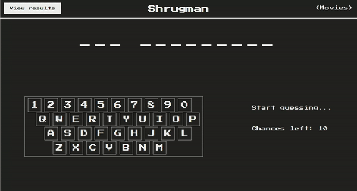

  
  
  
  

<h1 align="center">Hi 👋, I'm Yu-An Chen</h1>
<h3 align="center">A curious fullstack developer from Taiwan, living in Germany</h3>

- 👨‍💻 All of my projects are available at [https://portfolio-react-3mi0m08a6-yuany2036.vercel.app/](https://portfolio-react-3mi0m08a6-yuany2036.vercel.app/)

- 💬 Ask me about **react, sass, javascript**

- 📫 How to reach me **yuany2036@gmail.com**

<h1 align="center">Projects</h1>
<table bordercolor="#66b2b2">
  
  <tr>
    <td width="50%" valign="top">
      <h3 align="center">Game of Thrones API</h3>
         
        
         
        

          
    
  
      

        
<strong>Javascript, React & Sass</strong> -  A simple website displaying various characters from the Game of Thrones show, as well as a gallery to view different photos from the show!

    </td>
    <td width="50%" valign="top">
      <h3 align="center">Shrugman</h3>
         
      
         
        

          
  
  
      

        
<strong>Javascript, React & Scss</strong> - Ready to have a snazzy shurggy tell you off while you guess the titles of works of art? Then click the link and get started!

    </td>
  </tr>
  
  <tr>
    <td width="50%" valign="top">
      <h3 align="center">ShawnCharles.com</h3>
       
        
       
        

  
  
      

        
<strong>HTML5, CSS3, & Javascript</strong> - Portfolio Site including links to my projects and ways to get in contact with me.

    </td>
    <td width="50%" valign="top">
      <h3 align="center">Matching Cards</h3>
         
        
         
        

          
  
  
      

        
<strong>HTML5, CSS3, & Javascript</strong> - With over 100 different cards, test your memory in these three popular trading card themes, Pokemon, Yugioh, & Magic: The Gathering!

    </td>
  </tr>
</table>

<h1> Coding Challenges on Code Wars:</h1>

 

<h1 align="center">Languages and Tools:</h1>

            

